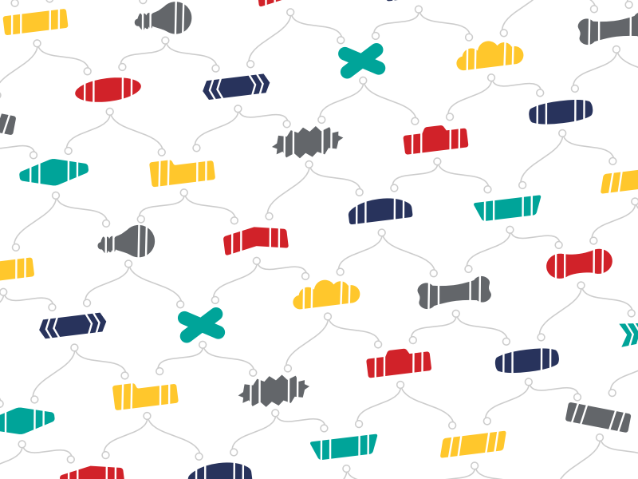
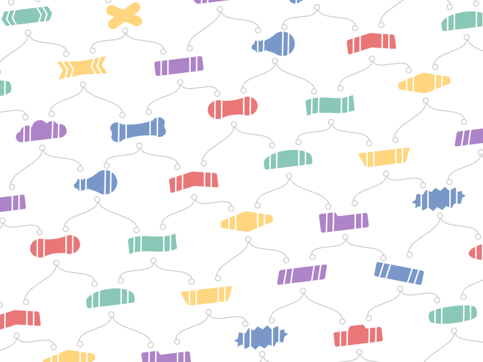
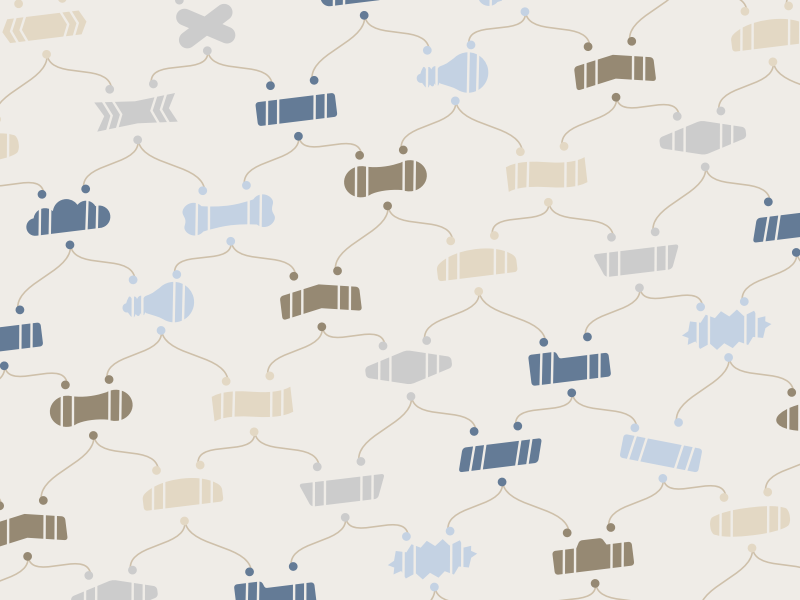
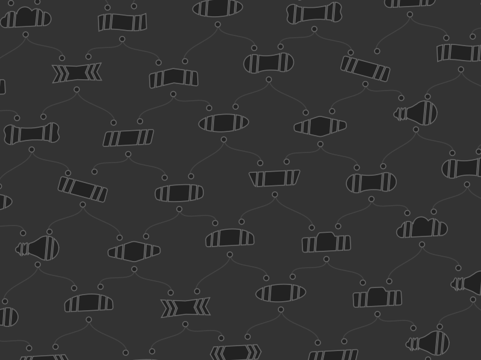
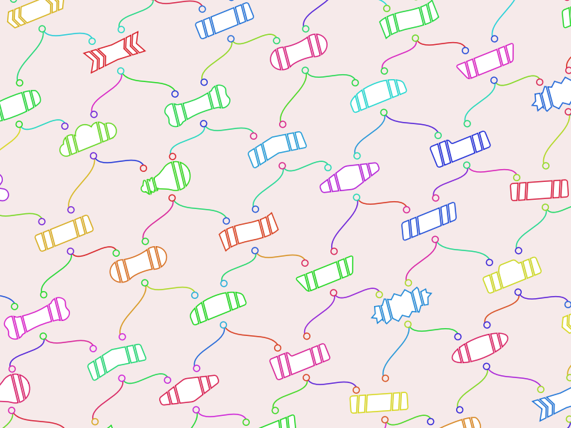

# Houdini wallpaper pattern generator

This Python script generates patterns (SVG or bitmaps) based on the look of Houdini node networks. The patterns might be useful as desktop wallpaper or wrapping paper for gifts for the Houdini nerd in your life.

## Usage

    python wallpaper.py [options] outfile
   
If ``outfile`` ends with ``.svg``, the script will output an SVG vector image.

If ``outfile`` ends with  ``.png`` or ``.jpg``, the script will try to use Qt's SVG libraries to render the image. If you have Houdini, you can start a Houdini shell and run the script using ``hython`` to ensure Qt is available. Otherwise, you will need to install either PySide2 or PyQt5.

## Examples

``fun.cfg``

``desert.cfg``

``lowkey.cfg``

``wonder.cfg``

``party.cfg``

``xmas.cfg``

## Options

``--width=1920`` (or ``-W``)

The width of the output image (in pixels).

``--height=1080`` (or ``-H``)

The height of the output image (in pixels).

``--scale=0.8`` (or ``-s``)

A scaling factor for the vector art. Use this to make the pattern bigger or smaller.

``--rotate=-7.0`` (or ``-r``)

Rotation of the pattern (in degrees). Negative numbers rotate counter-clockwise.

``--slop=5``

Instead of doing actual math to know how many extra rows/columns to generate to fill empty space in the image when the pattern is rotated, the script simply adds this many. If you scale the pattern down and/or rotate close to diagonal, it's possible the default won't be enough, in which case you can increase this.

``--background=ffffff``

The background color, as hex or a named HTML color. (You can use ``transparent`` to leave the background transparent if the image format supports transparency.)

``--shape=cycle``

The name of a specific node shape to use, or ``cycle`` (cycle though the available shapes), or ``random`` (randomly choose each shape).

The available shapes are: ``cigar, ensign, arc, camera, slash, diamond, tab, bone, chevron, pointy, oval, null, trap, tilt, peanut, cloud, rect, flag, light, or burst``.

``--scheme=raymond``

The name of a color scheme, or a string of comma-separated hex colors, for use when colors are cycled or random.

For example

    python wallpaper.py --scheme=blues test.png
    
    python wallpaper.py --scheme=E37B40,46B29D,DE5B49,324D5C,F0CA4D test.png

The preset schemes are ``cool, pastel, sunrise, blues, raymond, desert, sports, garden, lowkey, wonder, or xmas``.

Instead of a fixed color scheme, you can specify the scheme as ``random`` to choose hues at random as needed. Use the ``--saturation`` and ``--lightness`` options to specify the saturation and lightness of the random colors. 

``--nodestroke=none``

The color to use to draw node outlines (as hex), or ``cycle`` to cycle through the color scheme colors, or ``random`` to randomly choose a color scheme color, or ``none`` to not draw node outlines.

``--nodefill=cycle``

The color to use to fill node shapes (as hex), or ``cycle`` to cycle through the color scheme colors, or ``random`` to randomly choose a color scheme color, or ``none`` to not fill nodes.

``--wirestroke=cccccc``

The color to use to draw "wires" (as hex), or ``cycle`` to cycle through the color scheme colors, or ``random`` to randomly choose a color scheme color, or ``none`` to not draw wires.

``--wirestyle=bezier``

How to draw the "wires" connecting the nodes: ``bezier`` or ``straight``.

``--connstroke=cccccc``

The color to use to draw connector outlines (as hex), or ``cycle`` to cycle through the color scheme colors, or ``random`` to randomly choose a color scheme color, or ``none`` to not draw connector outlines.

``--connfill=background``

The color to use to fill connectors (as hex), or ``cycle`` to cycle through the color scheme colors, or ``random`` to randomly choose a color scheme color, or ``background`` to use the background color.

``--strokewidth=2.0``

The width (in pixels) to draw node outlines. If you don't specify ``--wirewidth``, this is also used as the width to draw "wires".

``--wirewidth=<float>``

The width (in pixels) to draw "wires". If you don't specify this, the script uses the value of ``--strokewidth``.

``--saturation=1.0``, ``--lightness=0.5``

If you use ``--scheme=random``, instead of picking colors from a fixed set of colors, the script generates random hues as needed. These options let you set the saturation and lightness (as in the HSL color model) for the random hues.

### Configuration files

On the command line, when specifying options, you can reference a text file containing options by prefixing the config file path with `@`.

For example, if you have a file ``examples/party.cfg`` containing:

    --background=F6EAEA
    --nodestroke=random
    --nodefill=none
    --shape=cycle
    --connstroke=random
    --connfill=background
    --wirestroke=random
    --rotate=-22
    --scheme=random
    --saturation=0.7
    --seed=9001

...you can use those options like this:

    python wallpaper.py -W800 -H600 @examples/party.cfg examples/party.png
    
The option parser as if the options in the file were passed at the point where you referenced the file, so you can override them on the command line with later options. For example:

    python wallpaper.py -W800 -H600 @examples/xmas.cfg --shape=burst examples/xmas2.png

__Warning__: this feature comes from the ``argparse`` library and it can be a bit tetchy. For example, do not add more than one blank line at the end of the config file. If the option parser complains about unrecognized options when you use a config file, check for extra whitespace in the file.

